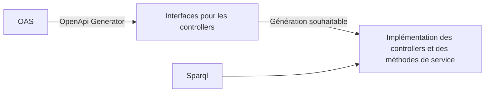

# De l'injection de méthodes dans Spring à l'aide de Spring AOP

---

## A propos de
- Fabrice Bibonne : support aux développeurs sur les technologies java
- Insee :
  - Produit, analyse et diffuse des informations sur l’économie et la société françaises
  - Diffuse également des métadonnées comme les référentiels géographiques à travers des API
- POC de la refonte de _Metadata API_ :
    - Approche contract first : **la spec OAS est une spécification**
    - Eviter la duplication de code
    - Technologies Java, Spring, Graph DB

---

## Processus de création du code

---

## Architecture _Metadata API_

---

## Systématiser l'écriture des controllers Spring

- Fonctionnement d'un controlleur (générique) :
  - Appeler la bonne requête Sparql
  - Convertir le résultat dans la bonne entité
  - La retourner
- ~~Extensions OpenApi Generator~~
- **Générer l'implémentation au runtime (comme Spring Data)**

---

## Génération par "injection de méthode"

- Spring introduit le concept d'[Injection de méthode](https://docs.spring.io/spring-framework/reference/core/beans/dependencies/factory-method-injection.html)
  - notamment [_Arbitrary Method Replacement_](https://docs.spring.io/spring-framework/reference/core/beans/dependencies/factory-method-injection.html#beans-factory-arbitrary-method-replacement)
- Cela pourrait faire l'affaire ?

<!-- 
L'injection de méthode sert en premier lieu à l'injection de beans de scope prorotype dans un bean de scope singleton si on veut que les  beans de scope prototype soient réinstanciés à chaque appel.
Spring appelle cela _Lookup Method Injection_ et utilise l'annotation lookup qui injecte un bean du type retourné par la méthode : un constructeur du dit bean doit prendre en argument 
les mêmes paramètres que la méthode : annotation @Lookup. L'appel à la méthode est donc remplacé à l'appel à un constructeur d'un bean de type identique à celui retourné par la méthode. 
On remplace donc l'appel à la méthode  par un appel à une méthode avec une signature identique (sinon exception levée). 
L'injection de beans de scopes différents peut également se faire grâce à l'AOP (https://docs.spring.io/spring-framework/reference/core/beans/factory-scopes.html#beans-factory-scopes-other-injection).
ET se fait automatiquement pour les beans type HttpServletRequest (scope request), HttpSession (scope session).

Un autre aspect de l'injection de méthode proposée par Spring est de permettre le remplacement de l'implémentation d'une méthode par une autre implémentation. Spring appelle cela _Arbitrary method replacement_. La
documentation ne propose pas de finalité particulière pour cet usage. Il n'est cependant accessible qu'avec une configuration via XML du contexte ou bien en écrivant manuellement les BeanDefinition : 
`controllerBeanDefinition.getMethodOverrides().addOverride(new ReplaceOverride("getCommuneById", "controllerImplementationReplacerBean"))`

Noter la limitation avec le component scanning qui ne prend en compte que les classes concrètes. Pour déclencher le mécanisme, il faut explicitement déclarer son bean comme devant être collecté.

Nous utilisons la version moins courante (Arbitrary Method Replacement) qui permet de complètement remplacer la méthode par une autre séquence de code : il n'est pas nécessaire que la 
signature corresponde. Cette dernière est moins employée et il ne semble pas exister d'annotation pour la mettre en oeuvre.
-->

---

## Le remplacement arbitraire de méthode ne fera pas l'affaire

  - Fonctionnalité peu utilisée : pas de support par annotations, pas d'API
  - Ne permet pas d'introduire du contrôle d'accès sur les contrôleurs (`@PreAuthorize`)

---

## Spring AOP : ce n'est pas...

---

## AOP

- Programmation orientée Aspect
  - Paradigme de programmation
  - On s'intéresse aux aspects transverses de l'application
  - La gestion des aspects est centralisée
  - On court-circuite les traitements métier pour y insérer les traitements relatifs aux aspects

---

## A quoi ça sert ?

- Traiter de manière centralisée des problèmes non métier
- Eviter de "polluer" le code métier
- Eviter la duplication / répétition de code
- Par exemple : gestion des transactions, du contrôle d'accès

---

## Implémentation dans Spring

---

## Implémentation dans Spring

- Spring AOP est un composant au coeur du projet Spring Framework
- Proxyfication : deux solutions :
  - [cglib (code generation library)](https://github.com/cglib/cglib?tab=readme-ov-file#cglib-) repackagé par Spring
<!--cglib n'est plus maintenue. Depuis 2012, la base de code est incluse dans le package org.springframework.cglib et maintenue pas Spring. La question de se départir de cglib dans Spring a donc été 
tranchée en juillet 2023 pour la versions 6.x : c'est une trop grosse maintenance, Spring conserve sa dépendance à sa version interne de cglib : https://github.com/spring-projects/spring-framework/issues/12840#issuecomment-1633207941-->
  - [Proxy du JDK](https://docs.oracle.com/en/java/javase/21/docs/api/java.base/java/lang/reflect/Proxy.html)
<!--Les proxys dynamiques du JDK permettent de créer à l'exécution des objets qui agissent comme des instances d'interfaces mais qui permettent de modifier l'invocation des méthodes.
L'invocation de code spécifique se fait à travers un objet java.lang.reflect.InvocationHandler rattaché au proxy-->
- Déclaration des pointcuts
  - XMl ou annotations AspectJ
  - via [une vraie API](https://docs.spring.io/spring-framework/reference/core/aop-api.html)

- Point d'entrée de l'API
  - ProxyFactoryBean
  - MethodInterceptor
  - NameMatchMethodPointcutAdvisor
<!-- https://docs.spring.io/spring-framework/reference/core/aop-api/prog.html -->

---

## Les contrôleurs de _metadata api_ avec l'AOP
  - Listener :
    - Recherche des interfaces de controllers
    - Création des Beans advisors
    - Création des ProxyBean des controllers
  - MethodInterceptor
    - Appeler la requête Sparql
    - Convertir le résultat dans la bonne entité
    - Retourner l'entité

12. Spring Data ... ?

- Conclusion
  - élargissement : la génération de clients, le cache
  - Spring AOP et compilation native (ça fonctionne sur Method Replacement ?)
  - Autres solutions (génération de code avec api tools generator)
  
- Liens
  - Projet : un tag avec injection de méthode et un tag avec Spring AOP
  - Injection de méthode dans la doc Spring : https://docs.spring.io/spring-framework/reference/core/beans/dependencies/factory-method-injection.html

<!--
Améliorations:
- Listeners en record
- craft ControllerConfiguration
- opérateur SPARQL pour String templates
- factory pour les advisors ?
- Faire tourner l'application ?
- Finir implémenter les méthodes manquantes !

Vérifications:
- Voir https://github.com/spring-projects/spring-framework/issues/32565

  

 
# Notes
- Trop long : 17:20
- Montrer du code
- raccourcir "A propos de"
- jolies diapos
- archi de Metadata
- Systématiser l'écriture des controllers Spring -> code controller generique
- Injection de méthode : racourcir : 1 diapo

# Remarques François

Découpage de la première diapo : changer dès que tu parles de l'API à refondre.
Processus de création du code illisible : moins large et plus haut pour une police plus grosse
Contrôleur : 2 L ? Ou enlever le U
Spring AOP, j'aurais mis du miel de printemps AOP...
Implémentation dans Spring : image plus grosse...
Problème de puces sur implémentation dans Spring : peut-être la cause des interlignes en trop...

 -->
