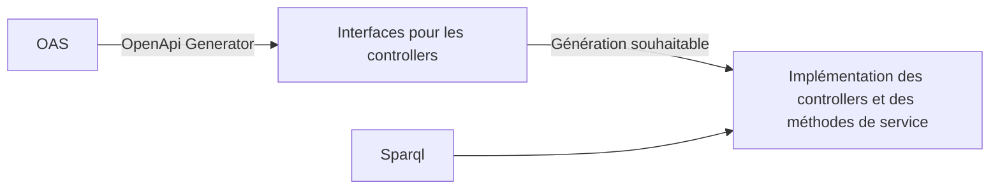

# De l'injection de méthodes dans Spring à l'aide de Spring AOP

> Spring framework propose depuis sa version 1 le concept d'injection de méthode. Celui-ci a cependant été peu mis en avant depuis et ne semble pouvoir être mis en oeuvre qu'à travers une définition xml du contexte Spring ou via l'API BeanDefinition : on n'est donc pas très emballé ! Les éditeurs du framework souhaitent-ils vraiment pousser à l'utilisation de cette fonctionnalité ? Et pourtant certains autres projets du framework l'utilisent. A travers un exemple concret où l'injection de méthode pourrait s'avérer bien utile, nous verrons comment nous pouvons mettre en oeuvre ce concept à l'aide de Spring AOP.

1. Présentation + Insee + Contexte
  - Fabrice Bibonne : support aux dev sur les technologies java
  - Insee :
    - Produit et diffuse des statistiques pour éclairer les questions économiques
      - **SNDIL recrute ?**
    - Diffuse également des métadonnées comme les référentiels géographiques à travers des API
      - ** pres Rmes extérieur en 1 phrase**
  - Question de la refonte de _Metadata API_ :
    - Approche contract first : **la spec OAS est une spécification**
    - Eviter la duplication de code
    - Technologies Java, Spring, Graph DB
2. Schéma cible

**exemples de code**

3. Implémentation manuelle typique d'un Controller

4. Systématiser l'écriture
  - Exemple de méthode générique
  - ~~Extensions OpenApi Generator~~
  - Générer l'implémentation au runtime (comme Spring Data)

5. Génération par "injection de méthode"

> A less useful form of **method injection** than lookup method injection is the ability to replace arbitrary methods in a managed bean with another method implementation. [...]
> With XML-based configuration metadata, you can use the replaced-method element to replace an existing method implementation with another, for a deployed bean. [...] A class that implements the **org.springframework.beans.factory.support.MethodReplacer** interface provides the new method definition

<!--L'injection de méthode fonctionne en premier lieu avec l'annotation lookup qui injecte un bean du type retourné par la méthode. Un constructeur du dit bean doit prendre en argument 
les mêmes paramètres que la méthode : annotation @Lookup. L'appel à la méthode est donc remplacé à l'appel à un constructeur d'un bean de type identique à celui retourné par la méthode. 
On remplace donc l'appel à la méthode  par un appel à une méthode avec une signature identique (sinon exception levée). l'usage de cette annotation sert à gérer l'injection de beans 
de scopes différents. Ce qui peut également se faire grâce à l'AOP (https://docs.spring.io/spring-framework/reference/core/beans/factory-scopes.html#beans-factory-scopes-other-injection)
ET qui se fait automatiquement pour les bean type HttpRequest

Noter la limitation avec le component scanning qui ne prend en compte que les classes concrètes. Pour déclencher le mécanisme, il faut explicitement déclarer son bean comme devant être collecté.

Nous utilisons la version moins courante (Arbitrary Method Replacement) qui permet de complètement remplacer la méthode par une autre séquence de code : il n'est pas nécessaire que la 
signature corresponde. Cette dernière est moins employée et il ne semble pas exister d'annotation pour la mettre en oeuvre.
-->

```java
AbstractBeanDefinition controllerBeanDefinition = resolveControllerBean();
controllerBeanDefinition.setMethodOverrides(

controllerBeanDefinition.prepareMethodOverrides();

```

**Ligne de 

6. 

- Conclusion
  - élargissement : la génération de clients, le cache
  - Spring AOP et compilation native   
- Liens
  - Projet : un tag avec injection de méthode et un tag avec Spring AOP
  - Injection de méthode dans la doc Spring : https://docs.spring.io/spring-framework/reference/core/beans/dependencies/factory-method-injection.html

1. Spring AOP
  - Ce n'est pas
  - pgm orientée aspect
  - Proxy
3. Use case
  - Api contract first
  - implémentation controlleur identiques
4. Injection de méthode
  - Injection de méthode Spring dans les interfaces générées de controlleurs
    AbstractBeanDefinition -> MethodOverride -> ReplaceOverride -> MethodReplacer 
  - Extension impossible !
5. Application de Spring AOP
  - Comme Spring Data, Spring security,...
  - Code
6. Ouverture
  - Annotation ?
  - Autres cas d'usage
  - Autres solutions (génération de code avec api tools generator)
